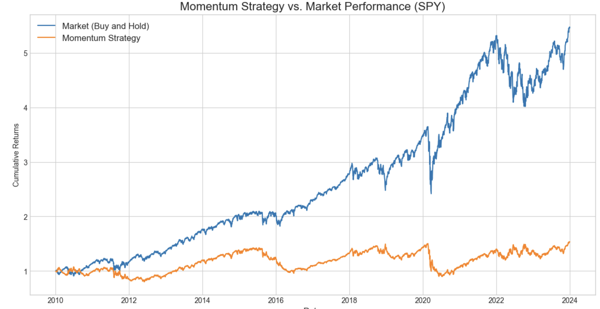

# Algorithmic Trading Strategy Back-tester

### Python (Pandas, NumPy, yfinance, Matplotlib)

## Project Overview

This project involved developing a vectorized back-testing engine from scratch to simulate and evaluate a momentum-based trading strategy on historical S&P 500 data (SPY ETF from 2010 to 2023).

The primary goal was to create a reusable framework for testing trading ideas and to rigorously assess the viability of a common technical indicator—the moving average crossover.

## Methodology

*   **Strategy:** A long-only strategy based on the "Golden Cross." A position is held when the 50-day Simple Moving Average (SMA) is above the 200-day SMA. The position is exited (flat) when the 50-day SMA is below the 200-day SMA.
*   **Vectorized Engine:** The back-tester avoids `for` loops and uses vectorized operations in Pandas and NumPy for high-performance calculations of signals and returns, which is the standard practice in quantitative research.
*   **Execution Assumption:** To prevent lookahead bias, positions are entered on the day *after* a signal is generated, based on the previous day's closing prices. This simulation does not account for transaction costs or slippage.

## Performance & Analysis

The strategy was evaluated using standard risk and return metrics.

| Metric                        | Result    |
| ----------------------------- | --------- |
| Compound Annual Growth (CAGR) | **3.10%**   |
| Annualized Volatility         | **17.35%**  |
| Sharpe Ratio                  | **0.18**    |
| Maximum Drawdown              | **-40.12%** |

### Quant Trader's Conclusion

While the back-testing engine was successfully built, the analysis reveals that this simple momentum strategy is not viable for live trading. The risk-adjusted return (Sharpe Ratio of 0.18) is extremely low, and the maximum drawdown of -40.12% is unacceptably high, especially when compared to a simple "buy and hold" approach over the same period. This project serves as a critical baseline and demonstrates the importance of rigorous back-testing before deploying capital.

## How to Run This Project

1.  Clone this repository.
2.  Ensure you have a Conda environment with the required packages: `pip install jupyter pandas numpy matplotlib yfinance`
3.  Run the Jupyter Notebook: `jupyter notebook momentum_analysis.ipynb`